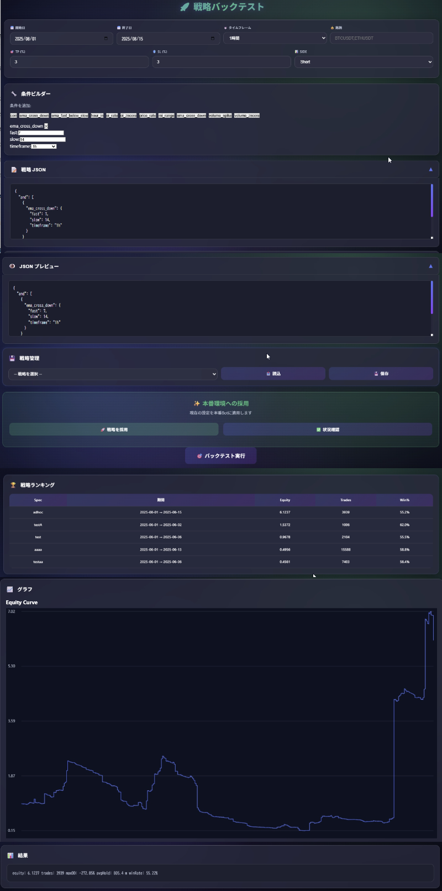

# AIアシステッド開発による個人向け暗号資産取引プラットフォーム

**プログラミング未経験から4ヶ月。ChatGPTをはじめLLMとの対話のみで構築した、Bybitにおける取引戦略開発からbot本番運用までをカバーするフルスタック取引システムです。**

---

### 💡 プロジェクト概要

本プロジェクトは、一個人が暗号資産の自動売買を行うために必要な全ての機能を統合したプラットフォームです。企画、設計、開発、インフラ構築の全てを、会社員としての業務の傍ら4ヶ月(4/16~8/16)という短期間で独力でベータ版を完成させました。

最大の特徴は、私自身がプログラミング未経験であったため、**実現したい機能を明確に定義し、それを達成するための技術要素をChatGPTとの対話を通じて具体化・実装していく**という「AIアシステッド開発」の手法を全面的に採用した点にあります。

**[▶️ デモ動画（YouTube）](https://youtu.be/lTrbXQDxeT8)**

---

### 🏛️ システムアーキテクチャ

本システムは、責務ごとに分割された複数のコンポーネントが連携して動作するマイクロサービス的なアーキテクチャを採用しています。これにより、各機能の独立性が保たれ、メンテナンス性と拡張性に優れた設計となっています。
これにより、各機能の独立性が保たれ、メンテナンス性と拡張性に優れた設計となっています。

<em>システムの全体構成図。ユーザー操作（左下）、Botの各プロセス（中央）、外部サービス（右下）の連携を示しています。</em>

---

### ✨ 主な機能

本システムは、**「戦略のアイデアを練り、テストする」フェーズと、「その戦略を市場で24時間動かす」フェーズを、Web UIを通じてシームレスに繋ぐプラットフォームです。

*   **Webベースの戦略開発UI**: ブラウザ上で取引条件を視覚的に組み合わせ、コーディング不要で戦略を構築・保存できます。
*   **高速な並列処理バックテストエンジン**: 複数CPUコアを活用し、多数の銘柄・長期間の戦略検証を高速に実行。パフォーマンスをグラフで視覚的に評価できます。
*   **ワンクリック・デプロイ機能**: バックテストで検証済みの戦略を、ボタン一つで稼働中の本番Botに安全に適用します。
*   **24時間稼働のリアルタイム取引Bot**: WebSocketで市場データをリアルタイムに受信し、自動で取引を実行。システムが再起動しても取引状態を失わない堅牢な状態永続化の仕組みを備えています。
*   **堅牢なデータパイプライン**: Bybit APIから価格・OIデータを自動収集し、データベースに保存。APIのレート制限やネットワークエラーにも自動で対応します。
*   **リスク管理・監視ダッシュボード**: VPSのリソースやBotの稼働状況をブラウザからリアルタイムに監視し、**取引の緊急停止・再開**を遠隔で安全に操作可能です。

#### ■ 具体的な動作フロー

**1. 【戦略開発】 Web UIによる高速な戦略開発とバックテスト**

まず、ブラウザ上の**戦略ビルダー**で「EMAがクロスしたら」「RSIが一定範囲なら」といった取引条件を自由に組み合わせ、エントリーロジックを視覚的に構築します。TP/SL率やテスト期間、対象銘柄などを設定し、「バックテスト実行」ボタンをクリックすると、**バックテストエンジン**がデータベースから過去データを読み込み、**高速に並列処理**で検証を実行。完了後、エクイティカーブなどの詳細なパフォーマンスが画面に表示され、戦略の有効性を客観的に評価できます。有望な戦略は、名前をつけて保存し、いつでも再利用可能です。

  

  <em>戦略の構築からバックテスト、結果の視覚的評価、本番採用までを、この一つの画面でシームレスに行うことができます。</em>

**2. 【本番運用】 ワンクリックでの戦略適用と24時間自動取引**

バックテストで有望だった戦略を、Web UIから**「戦略を採用」ボタン一つで、稼働中の本番Botに安全にデプロイ**します。デプロイされると、本番Bot (`yaona_short_v1.py`) はcronにより定期的に起動し、採用された戦略 (`active.json`) に基づいて取引チャンスを探します。

シグナルが発生すると、**リスク管理モジュール** (`risk.py`) が適切な注文サイズを計算し、Bybitへ指値注文を送信。注文が約定すると、**WebSocketリスナー** (`ws_listener.py`) が即座に検知し、**ポジション監視プロセス** (`position_monitor.py`) がTP/SL注文を自動で発注、同時にDiscordへ「エントリーしました」と通知します。

**3. 【決済とリスク管理】 安全な自動取引の継続**

ポジションがTP/SLにかかって決済されると、その結果（損益、保有時間など）もリアルタイムでDiscordに通知されます。これらの取引は、**リスク制御システム** (`risk_control.py`) によって常時監視されており、設定された連敗回数や1日の最大損失額を超えると、新規エントリーが自動的に停止され、資産が保護されます。

市場の急変時には、Webダッシュボードから**「緊急停止」**ボタンを押すことで、全てのポジションを即座に手仕舞いし、新規エントリーを停止させる遠隔操作も可能です。

  

  <em>VPSの稼働状況とBotの取引制御を行うモバイルフレンドリーなダッシュボード</em>

### ギャラリー：Discordによるリアルタイムな情報連携

本システムは、取引のあらゆるフェーズでDiscordと連携し、リッチな通知を通じてリアルタイムに状況を把握することができます。

<table border="0">
 <tr>
    <td></td>
    <td></td>
 </tr>
 <tr>
    <td align="center"><b>1. エントリー候補の通知</b> Botが取引チャンスを見つけると、投入額やリスク設定と共に即座に通知します。</td>
    <td align="center"><b>2. TP/SLによる決済報告</b> ポジションが決済されると、損益や保有時間などの詳細な結果がリアルタイムで報告されます。</td>
 </tr>
  <tr>
    <td></td>
    <td></td>
 </tr>
  <tr>
    <td align="center"><b>3. ウォレット・ポジション定期レポート</b> 現在の資産状況や保有ポジションのサマリが定期的に送られ、全体の状況を把握できます。</td>
    <td align="center"><b>4. システム死活監視 (Watchdog)</b> 各プロセスが正常に稼働しているか常時監視し、異常があれば即座にアラートが飛びます。</td>
 </tr>
</table>

### 🛠️ 技術スタック

-   **バックエンド**: Python, FastAPI, Flask, Pandas, NumPy, SQLAlchemy
-   **フロントエンド**: HTML, CSS, JavaScript (Vanilla JS)
-   **データベース**: TimescaleDB (PostgreSQL)
-   **インフラ**: VPS (Linux), systemd, cron, Nginx
-   **開発補助**: **ChatGPT-4o/o3/5  (仕様具体化・コーディング・デバッグ支援)**, Gemini, Claude他もコーディング時に併用

---

### 📁 コードサンプル

本プロジェクトの完全なソースコードは、取引戦略という知的財産を含むため非公開としておりますが、システムの設計思想と技術力を示す代表的なコンポーネントを以下に示します。

*   **[データパイプライン (`incremental_save_all.py`)](./samples/incremental_save_all.py)**: 並列処理、APIエラーハンドリング、高速なDB書き込みなど、本番運用に耐えうる堅牢なデータ収集基盤の実装例です。
*   **[戦略コンパイラ (`strategy_builder.py`)](./samples/strategy_builder.py)**: JSON形式の宣言的なルールから、実行可能なPythonの戦略関数を動的に生成する、本システムのコアとなるコンポーネントです。
*   **[ポジション監視 (`position_monitor.py`)](./samples/position_monitor.py)**: WebSocketからのリアルタイムイベントを処理し、エントリーから決済までポジションの全ライフサイクルと状態を管理する、システムの心臓部です。
*   **[リスク制御 (`risk_control.py`)](./samples/risk_control.py)**: 連敗数や日次ドローダウンを監視し、資産を守るためにシステムを安全に自動停止させる、トレーディングドメインのロジックです。

---

### 🔐 知的財産について

本プロジェクトの完全なソースコードはプライベートリポジトリで厳重に管理しております。面接の過程でご要望がありましたら、限定的なアクセス権の付与、または画面共有でのコードウォークスルーが可能です。
